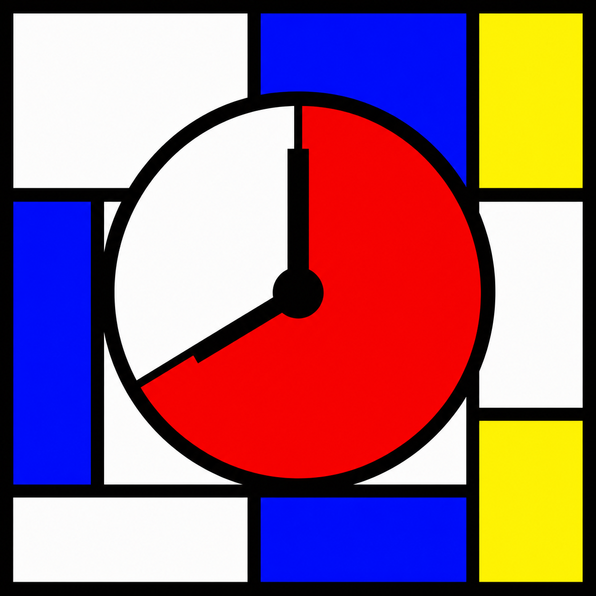

# Pomodoro Timer



A standalone Flutter desktop Pomodoro timer for Windows, styled as a De Stijl-inspired composition with thick black grid lines, primary color blocks, and a frameless resizable window.

## Features

- 25-minute work sessions
- 5-minute short breaks
- 15-minute long breaks after every 4 completed work sessions
- Start, pause, and reset controls
- Completed Pomodoro tracking for the current session
- Native Windows toast notifications when a phase ends
- Responsive Mondrian-style layout for compact and wider window sizes

## Tech Stack

- Flutter
- Dart
- Riverpod for timer state management
- `window_manager` for the frameless desktop window
- `local_notifier` for Windows notifications
- `fake_async` and `flutter_test` for tests

## Requirements

- Flutter SDK with Dart `^3.11.5`
- Windows desktop support enabled for Flutter

Check your local Flutter setup with:

```powershell
flutter doctor
```

If Windows desktop support is not enabled:

```powershell
flutter config --enable-windows-desktop
```

## Getting Started

Install dependencies:

```powershell
flutter pub get
```

Run the app on Windows:

```powershell
flutter run -d windows
```

Run tests:

```powershell
flutter test
```

Build a Windows release:

```powershell
flutter build windows
```

The release output is generated under:

```text
build/windows/x64/runner/Release/
```

## Project Structure

```text
lib/main.dart              App entry point, timer state, UI, and Windows setup
test/widget_test.dart      Timer controller and widget tests
assets/icons/              App icon assets
windows/                   Flutter Windows runner project
pubspec.yaml               Package metadata and dependencies
```

## Timer Behavior

The timer starts in the `Work` phase with `25:00` remaining. When a work session completes, the app advances to a short break unless the completed session count is divisible by 4, in which case it advances to a long break. After any break completes, the next phase is another work session.

Pressing reset during an active or partially elapsed phase restores the current phase duration. Pressing reset again from a full work phase resets the full session state.

## Design

The interface uses a strict De Stijl palette:

- Red: `#FF0000`
- Blue: `#0000FF`
- Yellow: `#FFFF00`
- White: `#FFFFFF`
- Black: `#000000`

The UI is built from rectangular panels separated by thick black grid lines, with the timer progress shown as a yellow fill rising behind the remaining time.
